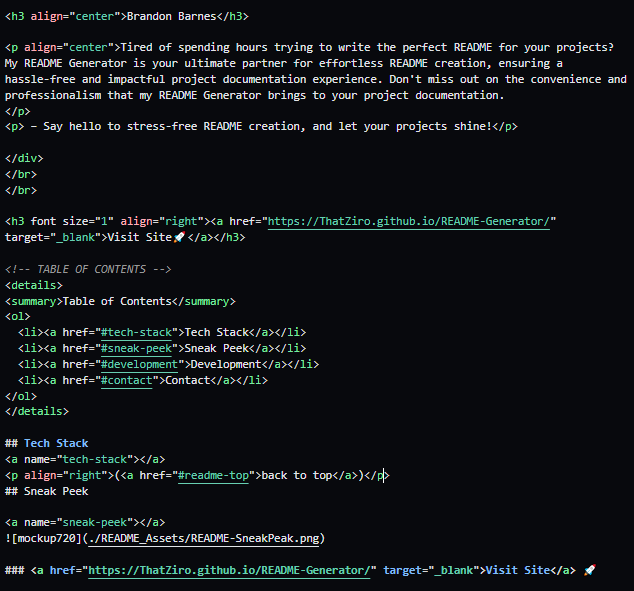

  
  
  [![Contributors][contributors-shield]][contributors-url]
  [![Forks][forks-shield]][forks-url]
  [![Stargazers][stars-shield]][stars-url]
  [![Issues][issues-shield]][issues-url]
  [![MIT License][license-shield]][license-url]
  [![LinkedIn][linkedin-shield]][linkedin-url]
  
  

  

  <h3 align="center">Brandon Barnes</h3>

  
Tired of spending hours trying to write the perfect README for your projects? My README Generator is your ultimate partner for effortless README creation, ensuring a hassle-free and impactful project documentation experience. Don't miss out on the convenience and professionalism that my README Generator brings to your project documentation.
  

  
 – Say hello to stress-free README creation, and let your projects shine!

  

   
   

  <h3 font size="1" align="right"><a href="https://ThatZiro.github.io/README-Generator/" target="_blank">Visit Site🚀</a></h3>
  
  <!-- TABLE OF CONTENTS -->
  

  
Table of Contents

  <ol>
    <li><a href="#tech-stack">Tech Stack</a></li>
    <li><a href="#sneak-peek">Sneak Peek</a></li>
    <li><a href="#development">Development</a></li>
    <li><a href="#contact">Contact</a></li>
  </ol>
  

  
  ## Tech Stack
  
  
(<a href="#readme-top">back to top</a>)

  ## Sneak Peek

  
  

  ### <a href="https://ThatZiro.github.io/README-Generator/" target="_blank">Visit Site</a> 🚀

  
(<a href="#readme-top">back to top</a>)

  
  
  ## Development

  

  ## Installation
  

  Clone this repo to your desktop and run npm install to intall all the dependencies.
Be sure to Update the README_Assets:
    [ README-Logo.png
    | README-SneakPeak.png
    | README-ResponsivenessSection.png (optional)
    | README-FlowSection.png (optional)
    | README-LayoutSection.png (optional) ]
  

  ## Useage
  

  After you cloned the repo and you have changed the README_Assets you can then run node index.js
Follow the prompts in the console and your personal readme will be generated.
  

  
  
(<a href="#readme-top">back to top</a>)

  
   ## Contact

  

  <h4>Twitter - <a href="https://twitter.com/undefined">@ThatZiro</a></h4>
  <h4>Email - <a href="mailto:imbrandonbarnes@gmail.com">imbrandonbarnes@gmail.com</a></h4>
  <h4>Github - <a href="https://github.com/ThatZiro">ThatZiro</a></h4>
  <h4>Linkedin - <a href="https://www.linkedin.com/in/brandon-barnes-4b2098232/">Brandon Barnes</a></h4>

  
(<a href="#readme-top">back to top</a>)

  <!-- MARKDOWN LINKS & IMAGES -->
  <!-- https://www.markdownguide.org/basic-syntax/#reference-style-links -->

  [contributors-shield]: https://img.shields.io/github/contributors/ThatZiro/README-Generator.svg?style=for-the-badge
  [contributors-url]: https://github.com/ThatZiro/README-Generator/graphs/contributors
  [forks-shield]: https://img.shields.io/github/forks/ThatZiro/README-Generator.svg?style=for-the-badge
  [forks-url]: https://github.com/ThatZiro/README-Generator/network/members
  [stars-shield]: https://img.shields.io/github/stars/ThatZiro/README-Generator.svg?style=for-the-badge
  [stars-url]: https://github.com/ThatZiro/README-Generator/stargazers
  [issues-shield]: https://img.shields.io/github/issues/ThatZiro/README-Generator.svg?style=for-the-badge
  [issues-url]: https://github.com/ThatZiro/README-Generator/issues
  [license-shield]: https://img.shields.io/github/license/ThatZiro/README-Generator.svg?style=for-the-badge
  [license-url]: https://github.com/ThatZiro/README-Generator/blob/master/LICENSE.txt
  [linkedin-shield]: https://img.shields.io/badge/-LinkedIn-black.svg?style=for-the-badge&logo=linkedin&colorB=555
  [linkedin-url]: https://linkedin.com/in/linkedin_username

  